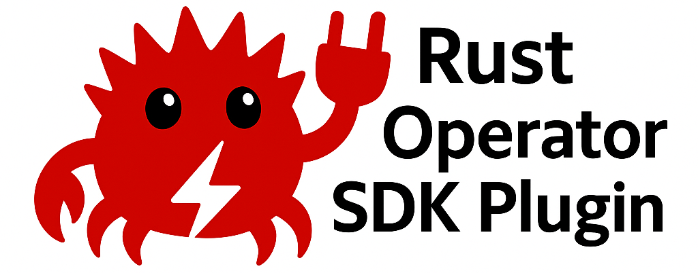

A Rust-based plugin for the [Operator SDK](https://sdk.operatorframework.io/) that helps you scaffold Kubernetes Operators with Rust. This project aims to simplify and enhance the development experience for Kubernetes operators written in Rust.

## Features

- An Operator SDK plugin to enable scaffolding, building, and testing (coming soon) Kubernetes operators with Rust.
- Supports common Kubernetes resources like CRDs, and controllers.
- Customizable templates and scaffolding for different operator components.
- Designed with the goal of improving the developer experience for Rust developers in the Kubernetes ecosystem.

## Why Rust?

* [The Rustvolution: How Rust Is the Future of Cloud Native - Flynn, Buoyant](https://www.youtube.com/watch?v=2q3RLffSvEc)
* [Why the future of the cloud will be built on Rust - Oliver Gould, Buoyant](https://www.youtube.com/watch?v=BWL4889RKhU)
* [Kubernetes Controllers in Rust: Fast, Safe, Sane - Matei David, Buoyant](https://www.youtube.com/watch?v=rXS-3hFYVjc)

## Installation

### Prerequisites

Ensure that you have the following installed on your system:

- [Go 1.23.x](https://golang.org/dl/)
- [Cargo CLI via Rust 1.87.x](https://www.rust-lang.org/)
- [Git CLI](https://git-scm.com/downloads)
- Make

### Installing the Plugin

To install this Rust Operator SDK plugin, use the following steps:

1. Clone the repository:

     ```bash
     git clone https://github.com/SystemCraftsman/rust-operator-plugins.git
     cd rust-operator-plugins
     ```
   
2. Initialize the Operator SDK within the project:

    ```bash
    make configure-sdk
    ````

    This fetches a required version of the Operator SDK, configures it for local development.

3. Build the plugin:

    ```bash
    make build
    ```

    This comamnd builds Operator SDK with the Rust Operator Plugin included.

4. Install the plugin (for local development):

    ```bash
    make install
    ```

    This installs an Operator SDK binary with the Rust Operator Plugin.

5. You should now be able to use the plugin with the Operator SDK CLI.

## Usage

Once installed, you can use this plugin with the `operator-sdk` command-line tool to initialize a new operator project
written in Rust.

### Initialize a New Operator

Following is an example of initializing the operator in your `<project_directory>`:

```bash
cd <project_directory>
operator-sdk init --plugins rust/v1alpha --domain <your-domain>
```

### Create API and Controller Base

To create a new API with resources and the controllers scaffolded, you should run a command as follows:

```bash
operator-sdk create api --group <your-api-group>  --version <api-version> --kind <crd-name>  --resource --controller
```

Additionally, you can create the `resource` and `controller` with separate commands.
